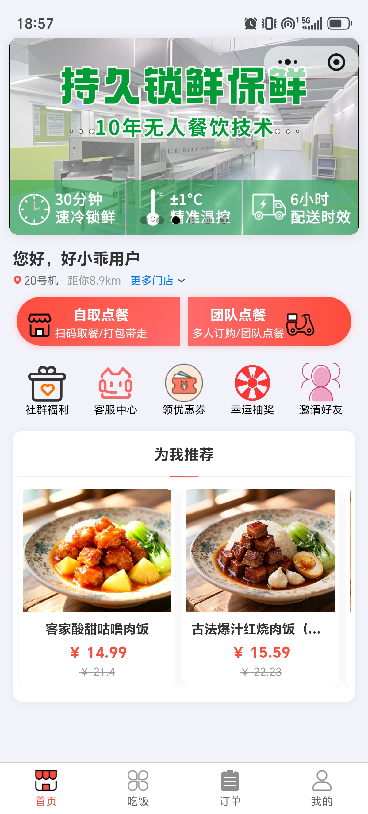
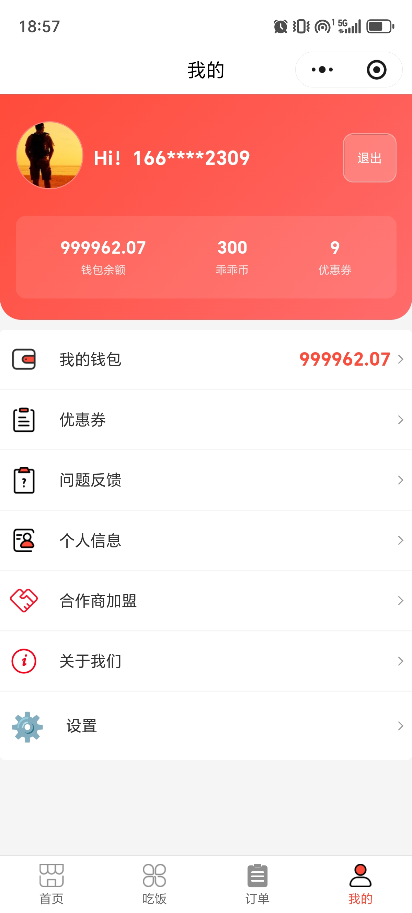

# 底部导航重构设计文档

## 1. 背景与目标

根据最新 UI 需求，应用底部导航栏将从三个 Tab 扩展为四个核心模块：**首页**、**吃饭**、**订单**、**我的**
。本次重构旨在通过更清晰的功能划分，提升用户点餐效率与设备查找体验。

## 2. 导航项详细设计

| 导航名称   | 对应页面             | 核心功能组件                                                     | 图标 (建议)                     |
|:-------|:-----------------|:-----------------------------------------------------------|:----------------------------|
| **首页** | `HomeView`       | 轮播海报、用户欢迎语、机器定位、**自取/团队点餐入口**、功能金刚区(福利/客服/优惠券等)、**为我推荐**列表 | `Icons.home_rounded`        |
| **吃饭** | `DeviceListView` | **取餐机**查找、常去/附近营业点切换、城市选择、**地图/列表视图**、设备状态(在线/距离)          | `Icons.grid_view_rounded`   |
| **订单** | `OrderListView`  | **食品/商城订单**切换、六大状态过滤(全部/待支付/已支付/已使用/已完成/退款)、订单详情卡片         | `Icons.assignment_outlined` |
| **我的** | `ProfileView`    | 用户头像与基本信息、**钱包/乖乖币/优惠券概览**、功能列表(钱包/反馈/合作商/设置等)             | `Icons.person_rounded`      |

## 3. 页面结构与 UI 元素细节

### 3.1 首页 (Home)

- **头部**：18:57 样式状态栏，顶部展示大尺寸运营海报。
- **欢迎区**：展示用户昵称（如：您好，好小乖用户），并显示当前关联的机器编号及距离（支持切换门店）。
- **核心入口**：采用红色高亮背景的两个并排大按钮：
  - **自取点餐**：扫码取餐/打包带走。
  - **团队点餐**：多人订购/团队点餐。
- **功能矩阵**：五项横向排列的圆形图标入口（社群福利、客服中心、领优惠券、幸运抽奖、邀请好友）。
- **推荐区**：垂直滚动的商品卡片流，包含商品图、名称、现价、原价。

### 3.2 吃饭 (Eat)

- **顶栏**：标题“取餐机”。
- **分类切换**：顶部分段式 Tab（常去营业点、附近营业点）。
- **交互区**：包含城市选择器、嵌入式地图预览、定位按钮。
- **列表区**：展示机器详细信息卡片，包含机器编号/位置名称、营业时间、具体地址、在线状态、距离、在线/已启用按钮。

### 3.3 订单 (Orders)

- **分类**：顶部滑动 Tab（食品订单、商城订单）。
- **状态过滤**：横向滚动的状态标签（全部订单、待支付、已支付、已使用、已完成、退款）。
- **订单卡片**：
  - 顶部：订单号、状态标签（如：已取消、已支付）。
  - 中部：商品缩略图、名称、规格、单价、数量。
  - 底部：商品总数、运费、合计金额、动态提示（如：订单将于今晚10点30分过期）。

### 3.4 我的 (Me)

- **头部卡片**：大面积红色渐变背景，左侧用户头像，中部欢迎语，右侧“退出”按钮。
- **资产概览**：白字展示钱包余额、乖乖币数量、优惠券数量。
- **列表菜单**：
  - 包含：我的钱包、优惠券、问题反馈、个人信息、合作商加盟、关于我们、设置。
  - 统一图标风格，右侧带前进箭头。

## 4. 技术实现方案

### 4.1 路由与导航控制

- 使用 `go_router` 的 `StatefulShellRoute` 实现四个分支的状态保持。
- 底部导航栏替换为 `google_nav_bar` 以获得更现代的动效。

### 4.2 视觉规范

- **主色调**：`#FF4D4D` (红色) 用于选中状态、核心按钮及个人中心背景。
- **背景色**：`#F8F8F8` (浅灰) 用于页面整体背景。
- **文字颜色**：主标题 `#333333`，次要信息 `#999999`。
- **圆角规范**：卡片采用 12px-16px 圆角。

## 5. 待办事项

- [x] 更新 `AppRoutes` 与 `AppRouter` 分支配置。
- [x] 在 `ScaffoldWithNavbar` 中集成 `google_nav_bar`。
- [ ] 按照截图 UI 细化 `HomeView` 的布局组件。
- [ ] 按照截图 UI 细化 `OrderListView` 的过滤逻辑与卡片。
- [ ] 完善 `ProfileView` 的头部背景与资产组件。
